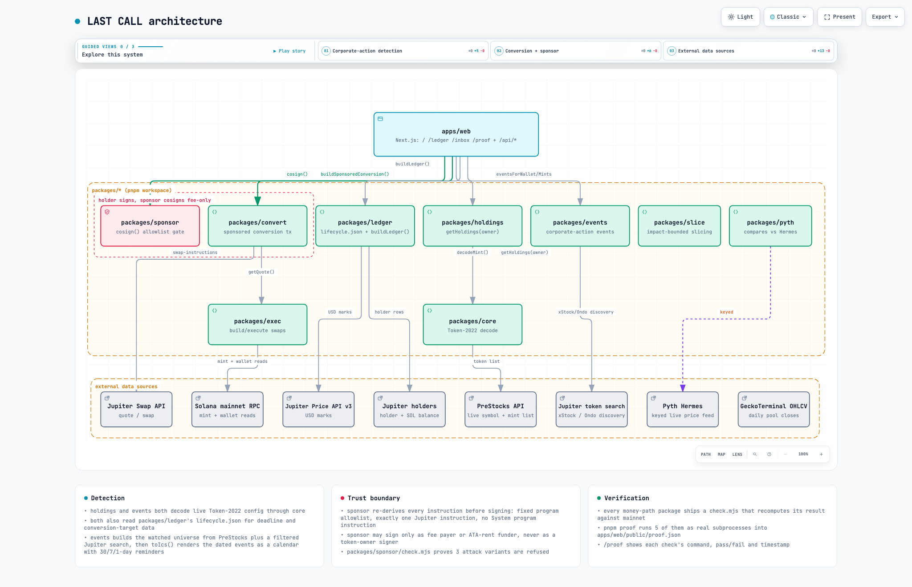

# LAST CALL: architecture

A pnpm monorepo: the packages under `packages/*` and one Next.js app, `frontend/`, that is the only consumer most users ever touch. Every package that decides money or a deadline reads live from Solana mainnet or a named API; nothing in the money path is cached longer than a few minutes, and nothing is mocked.

Diagram: [`docs/architecture/last-call-architecture.html`](docs/architecture/last-call-architecture.html) (interactive) or the static export below.

## Component map

| Package | Scope | Owns |
|---|---|---|
| `packages/core` | `@fineprint/core` | Token-2022 decode primitives shared by every other package: TLV extension parsing, scaled-UI-amount multiplier resolution (the `multiplier` vs `newMultiplier` trap that misreads SPACEX 5x wrong if you skip it), transfer-fee tier selection by epoch, the PreStocks API client, and the shared types (`MintFacts`, `SwapRequest`/`SwapResult`, `CostVerdict`). No other package hand-rolls a Token-2022 decode. |
| `packages/exec` | `@fineprint/exec` | Builds and executes Jupiter swaps: the quote/swap HTTP client (`lite-api.jup.ag/swap/v1`), an unsigned-transaction builder with pre/post associated-token-account checks, post-condition verification (destination balance moved by the expected net amount, within tolerance, after the transfer fee), and finalization polling. |
| `packages/convert` | `@lastcall/convert` | `buildSponsoredConversion()`: quotes the issuer's direct pool through Jupiter, requests swap instructions with the sponsor named as a separate fee payer, and rewrites any associated-token-account rent instruction Jupiter still billed to the owner so the sponsor pays it instead. |
| `packages/sponsor` | `@lastcall/sponsor` | `cosign()`, the only place the sponsor's private key touches a transaction. Checks the fee payer, the program allowlist, the Jupiter instruction count, and where the sponsor is allowed to appear as a signer, before adding its signature. |
| `packages/ledger` | `@lastcall/ledger` | `lifecycle.json` (deadline and conversion target per mint) plus `buildLedger()`, which joins the PreStocks API, on-chain supply, Jupiter's holders API and Jupiter search into the `/ledger` board. |
| `packages/holdings` | `@lastcall/holdings` | `getHoldings(owner)`: a wallet's Token-2022 balances, each resolved to a lifecycle status and a live Jupiter quote into its conversion target. |
| `packages/events` | `@lastcall/events` | `buildUniverse()` discovers every watched mint (PreStocks, xStock, Ondo); `eventsForWallet`/`eventsForMints` decode each mint's live Token-2022 config into four event types; `toIcs()` renders the dated ones as a calendar file. |
| `packages/slice` | `@lastcall/slice` | `planSlices()` binary-searches, in at most 8 live Jupiter quotes, the largest trade size that stays under a chosen price-impact ceiling; `buildSlice()` wraps `buildSponsoredConversion` for one slice. Exercised from its own CLI and `check.mjs` against live quotes. |
| `packages/pyth` | `@lastcall/pyth` | `convertVsSell()` compares selling a SPACEX holding now against converting it, pricing the converted SPCXx against a live Pyth Hermes feed instead of trusting Jupiter's own quote as the only mark. Prices come only from the live Hermes feed: a missing key throws instead of returning a made-up number. |
| `packages/cost` | `@fineprint/cost` | An on-chain-versus-TradFi (Forge, EquityZen, Hiive) round-trip cost comparison, carried over from the earlier project this repo grew out of. |

## Data sources

| Source | What LAST CALL reads | Used by |
|---|---|---|
| Solana mainnet RPC (`SOLANA_RPC_URL`, defaulting to `api.mainnet-beta.solana.com` or `solana-rpc.publicnode.com`) | Token-2022 mint accounts, decimals, transfer-fee tiers, scaled-UI-amount config, pausable and permanent-delegate authorities, wallet token accounts, epoch info, address lookup tables, transaction simulation | `core`, `exec`, `events`, `holdings`, `ledger`, `sponsor`, `convert` |
| Jupiter Swap API (`lite-api.jup.ag/swap/v1`) | quote, swap, swap-instructions | `exec`, `convert`, `slice`, `pyth`, the `/api/convert` and `/api/actions/convert` routes |
| Jupiter Price API v3 (`lite-api.jup.ag/price/v3`) | USD marks | `holdings`, `ledger`, `/api/gap-history` |
| Jupiter datapi holders (`datapi.jup.ag/v1/holders`) | per-holder balance and SOL balance | `ledger`'s largest-wallet table and 0-SOL flag |
| Jupiter token search (`lite-api.jup.ag/tokens/v2/search`) | xStock and Ondo discovery, filtered by Token-2022 program, verified flag and issuer signer; holder counts | `events`, `ledger` |
| GeckoTerminal OHLCV (`api.geckoterminal.com`) | daily close prices for the SPACEX and SPCXx pools | `/api/gap-history`, cross-checked against Jupiter's live price to catch a scale mismatch |
| PreStocks API (`prestocks.com/api/prestocks`) | the live PreStocks symbol and mint list | `ledger`, `holdings`, `events`. Read with exponential backoff; `holdings` falls back to the checked-in `lifecycle.json` mints |
| Pyth Hermes (`hermes.pyth.network`) | live SPCXX/USD and equity SPCX/USD feeds | `pyth` and the `/inbox` Pyth panel (with `PYTH_API_KEY`) |

## Flow 1: corporate-action detection for a wallet

Holdings feed the inbox; the inbox feeds the calendar.

1. The home page (`/`, a server component) and `GET /api/holdings?owner=<address>` both call `@lastcall/holdings.getHoldings(owner)`.
2. `getHoldings` reads the wallet's Token-2022 accounts from mainnet RPC, keeps only mints in the PreStocks/lifecycle universe, decodes each held mint with `@fineprint/core`'s multiplier and transfer-fee logic, prices it through Jupiter Price v3, and quotes its conversion target through the Jupiter Swap API. It returns one row per held mint, with amount, USD value, deadline status and a live conversion quote.
3. The inbox page (`/inbox`) and `GET /api/inbox.ics?wallet=<address>` call `@lastcall/events.eventsForWallet(owner)`; with no wallet, they call `eventsForMints()` over the full universe instead.
4. `eventsForWallet` builds the universe (`buildUniverse`: the PreStocks API plus a Jupiter search for xStock and Ondo mints), reads the wallet's balances, and batch-decodes every held mint's Token-2022 extensions against the current epoch (`getMultipleAccountsInfo`, up to 100 mints per call). Each mint's lifecycle entry and decoded config becomes zero or more of four event types: `conversion`, `dividend_or_split`, `fee_change`, `paused`, sorted action-required first.
5. `toIcs(events)` renders the dated events, conversion deadlines and multiplier changes, as a VCALENDAR with reminders 30, 7 and 1 day out. `GET /api/inbox.ics` streams the result as a downloadable attachment.

## Flow 2: conversion

1. In the browser, `WalletLookup` reads the wallet's raw on-chain balance for the mint, then `POST`s `{owner, fromMint, amountRaw}` to `/api/convert`. (The Blink flow below reaches the same builder through `/api/actions/convert` instead.)
2. `frontend/app/api/actions/convert/convert.ts`'s `buildConversionTransaction` looks up the conversion's destination mint from the ledger, then checks whether `SPONSOR_SECRET_KEY` is set.
   - **Sponsor configured:** `@lastcall/convert.buildSponsoredConversion` quotes the issuer's direct pool through Jupiter (trying `onlyDirectRoutes` first), requests swap instructions with the sponsor named as fee payer, rewrites any associated-token-account rent instruction still billed to the owner, and compiles an unsigned v0 transaction paid by the sponsor. `@lastcall/sponsor.cosign` then independently re-derives every instruction: fee payer must be the sponsor; every program must be on the allowlist (ComputeBudget, Jupiter v6, Associated Token, Token, Token-2022, nothing else); exactly one Jupiter instruction; the sponsor may sign only as fee payer or as an ATA-creation funder. Only after every check passes does it append the sponsor's signature.
   - **No sponsor:** a plain Jupiter swap paid by the owner.
3. The server returns `{txBase64, feePayer, sponsored}`.
4. The connected wallet (Wallet Standard `signAndSend`) adds the holder's signature, the one still missing. The holder authorizes the token movement; the sponsor's signature never does.
5. The browser sends the fully-signed transaction to the network. `@fineprint/exec.executeSwap` covers the equivalent build, sign, send, confirm and verify path for CLI and `check.mjs` callers, and is where the post-condition assertion lives: the destination balance must move by the expected net amount, within tolerance, after the Token-2022 transfer fee, or the result is reported as failed rather than merely sent.

## Flow 3: Blink (Solana Action)

1. `GET /actions.json` advertises this app as an action provider and maps `/api/actions/**` to it, scoped to Solana mainnet.
2. `GET /api/actions/convert?token=XAI|SPACEX` returns action metadata: a title, a description built from the live deadline in `lifecycle.json`, and two action links (`amount=all`, `amount=1`).
3. `POST /api/actions/convert?token=...&amount=...` with `{account}` resolves the amount, either the full on-chain balance or one whole token, and calls the same `buildConversionTransaction()` the `/convert` flow uses (sponsor path when configured), returning `{type: "transaction", transaction, message}`.
4. Whatever client renders the Blink (Dialect, a wallet extension, X) shows the metadata, has the wallet sign the returned transaction, and submits it. LAST CALL never receives the signed transaction or any private key.

## Trust boundaries

What the sponsor can sign: exactly the transaction `@lastcall/convert` built, acting as fee payer and, only inside an Associated Token Program create or createIdempotent instruction, as the rent funder. What `packages/sponsor/src/index.ts` refuses, checked before signing rather than after: a fee payer other than the sponsor; any top-level program outside the fixed allowlist; zero or more than one Jupiter instruction; a System program instruction, which would be a raw SOL transfer out of the sponsor; the sponsor appearing as a signer anywhere else in the transaction. The holder's own signature is what authorizes moving the holder's tokens. The sponsor never holds a key that can do that, and the holder never needs SOL to pay for the transaction.

`packages/sponsor/check.mjs` builds one real conversion and three attacks against it: an extra SOL transfer out of the sponsor, a different fee payer, and the swap instruction stripped out. `cosign` has to refuse all three for the check to pass; that is the test this trust boundary stands on.

## Verification layer

Every package that touches money or on-chain state ships a `check.mjs` that recomputes its own result independently of the code under test, against mainnet, instead of asserting against a fixture.

| Check | What it proves |
|---|---|
| `packages/convert/check.mjs` | Simulates a real conversion for a known 0-SOL wallet and checks the balance delta, the destination token received, and that the fee payer is a separate account from the holder. |
| `packages/ledger/check.mjs` | Recomputes unconverted supply from the mint and holder data and requires the ledger to match within 2%. |
| `packages/holdings/check.mjs` | Requires the exact on-chain balance for a known holder and a conversion quote in a sane range. |
| `packages/sponsor/check.mjs` | Signs a real conversion and requires three attack variants to be refused. |
| `packages/slice/check.mjs` | Re-quotes a slice and its single-shot equivalent independently; the slice must land under the impact threshold while the single shot sits above it. |
| `packages/events/check.mjs` | Rebuilds the universe and a wallet's event list, and checks the event types and sort order against a live read. |
| `frontend/check*.mjs` | Build and serve the app; the board, holdings API, convert API, inbox calendar, Blink metadata and layout constraints (no yellow above 10% of text, no horizontal scroll at 375px) all answer with live data. |

`pnpm proof` (`scripts/proof.mjs`) runs five of these checks (`convert-sim`, `sponsor-guard`, `ledger-recount`, `slice-plan`, `events`) as real subprocesses, keeps each command's last output line, and writes `frontend/public/proof.json`. `/proof` (`frontend/app/proof/page.tsx`) reads that file and shows each check's command, pass/fail and timestamp, so the page can only say a check passed if the subprocess actually exited 0 the last time someone ran it.
